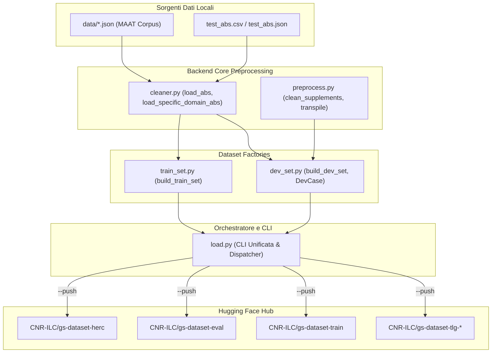

# GreekSchools – Pipeline di Gestione e Pubblicazione Dataset BERT

La directory `models/bert/dataset/` ospita i moduli responsabili della composizione, filtraggio, normalizzazione e pubblicazione su **Hugging Face Hub** dei dataset per il pre-addestramento (MLM) e la valutazione (Gap-Filling) dei modelli linguistici per il greco antico.

---

## 1. Tassonomia dei Dataset

I dataset gestiti si dividono in due categorie concettuali ben distinte:

1. **Dataset di Pre-addestramento (MLM - Masked Language Modeling)**:
   - Contengono frasi o chunk di testo continuo nel campo `text`.
   - Sono **model-agnostic**: preservano il casing originale, gli accenti e la punteggiatura. La normalizzazione model-specific avviene a valle durante il training.
2. **Dataset di Valutazione (Gap-Filling / Restauro Papirologico)**:
   - Contengono tuple `(x, y, gap_length)` dove `x` è il contesto con la lacuna target mascherata come `[...]` e `y` rappresenta le **gold labels reali** (integrazioni proposte dai filologi ed editori critici).
   - Pensati per testare le metriche di accuratezza: Exact Match Top-K, BERTScore F1, Cosine Similarity e Cluster Inclusion.

### Mappa dei Checkpoint su Hugging Face Hub

| Target CLI | Checkpoint su HF Hub | Tipo | Fonti dei Dati | Split | Note Principali |
|:---|:---|:---|:---|:---|:---|
| **`herc`** | `CNR-ILC/gs-dataset-herc` | Valutazione | MAAT (P.Herc.) + `test_abs.json` (PHerc. 1004) | `dev`, `test` | **Benchmark Ercolano**: `test` controllato da filologi, `dev` da MAAT P.Herc. |
| **`eval`** | `CNR-ILC/gs-dataset-eval` | Valutazione | MAAT P.Herc (quota dev) + `test_abs.json` | `dev`, `test` | Benchmark di valutazione generale |
| **`train`** | `CNR-ILC/gs-dataset-train` | Pre-training | Corpus MAAT (DDbDP, DCLP, EDH) | `train`, `dev` | Testo grezzo model-agnostic suddiviso per frasi |
| **`tlg`** | `CNR-ILC/gs-dataset-tlg-uncased`<br>`CNR-ILC/gs-dataset-tlg-cased` | Pre-training | Corpus TLG (Thesaurus Linguae Graecae) | `train` | Variante con casing preservato e variante uppercase |

---

## 2. Architettura dei Moduli



- [`load.py`](file:///home/gabriele/Documenti/projects/greekschools/gs-suggestions-dataset/models/bert/dataset/load.py): **Entry Point unificato**. Contiene la CLI `argparse`, le funzioni di build per ogni target (`build_herc_eval_dataset`, `build_corpus_train_dataset`, ecc.), la gestione del login ad Hugging Face e il caricamento con metadata.
- [`dev_set.py`](file:///home/gabriele/Documenti/projects/greekschools/gs-suggestions-dataset/models/bert/dataset/dev_set.py): Modulo specializzato nell'estrazione dei `DevCase` a partire dai restauri editoriali racchiusi tra parentesi quadre (`[...]`).
- [`train_set.py`](file:///home/gabriele/Documenti/projects/greekschools/gs-suggestions-dataset/models/bert/dataset/train_set.py): Modulo specializzato nell'estrazione e nel filtraggio qualitativo delle frasi di addestramento (soglia rapporto caratteri sconosciuti `<UNK>` e lunghezza minima).
- [`tlg.py`](file:///home/gabriele/Documenti/projects/greekschools/gs-suggestions-dataset/models/bert/dataset/tlg.py): Script specifico per il corpus TLG (mantenuto per retrocompatibilità).
- [`__init__.py`](file:///home/gabriele/Documenti/projects/greekschools/gs-suggestions-dataset/models/bert/dataset/__init__.py): Centralizza i nomi dei checkpoint e i template di descrizione per la Dataset Card.

---

## 3. Schemi dei Dati

### Schema Dataset di Valutazione (`herc`, `eval`)

| Campo | Tipo | Descrizione | Esempio |
|:---|:---|:---|:---|
| `x` | `string` | Testo con lacuna mascherata fedelmente | `"... κἂν ὅτι μάλιστα πλεῖον κακοπαθῆ κτώμε νος [....]ς ἤπερ ἥδηται ..."` |
| `y` | `list[string]` | Gold label(s) reali proposte dai filologi | `["οὕτως"]` |
| `gap_length` | `int32` | Lunghezza in caratteri della lacuna | `4` |
| `corpus_id` | `string` | Identificativo del corpus | `"DCLP"` |
| `file_id` | `string` | Identificativo del documento/papiro | `"62471"` o `"PHerc. 1004"` |
| `gap_type` | `string` | Tipologia di lacuna | `"default"`, `"word"`, `"suffix"` |

### Schema Dataset di Addestramento (`train`, `tlg`)

| Campo | Tipo | Descrizione | Esempio |
|:---|:---|:---|:---|
| `text` | `string` | Frase pulita (preserva casing e diacritici) | `"Οὐ μὴν ἀπο βιαστέον γε τοῦτ' ἐστιν διὰ τῶν κατὰ τὰς ἑρμηνείας ..."` |
| `corpus_id` | `string` | Corpus d'origine | `"DCLP"`, `"tlg"` |
| `file_id` | `string` | Identificativo del frammento | `"175276"` |
| `title` | `string` | Titolo del papiro o testo | `"P.Herc. 1044"` |

---

## 4. Guida Operativa alla CLI (`load.py`)

Lo script `load.py` può essere invocato direttamente come modulo Python.

### Modalità Dry-Run (Verifica Locale senza Upload)

Di default, `load.py` genera il dataset localmente e stampa a video un riassunto con numero di record per split e anteprima dei campi, senza richiedere autenticazione Hugging Face:

```bash
# Verifica locale del dataset Ercolano (gs-dataset-herc)
python -m models.bert.dataset.load --target herc

# Verifica locale con lacune limitate a 1-6 caratteri
python -m models.bert.dataset.load --target herc --min-gap 1 --max-gap 6

# Verifica del dataset di training MAAT
python -m models.bert.dataset.load --target train

# Verifica del dataset TLG
python -m models.bert.dataset.load --target tlg
```

### Pubblicazione su Hugging Face Hub (`--push`)

Aggiungendo il flag `--push` (oppure `--push-to-hub`), lo script effettua il login (usando il token `HF_TOKEN` definito in `.env`) e carica il dataset:

```bash
# Pubblica gs-dataset-herc su Hugging Face Hub
python -m models.bert.dataset.load --target herc --push

# Pubblica tutti i dataset in sequenza
python -m models.bert.dataset.load --target all --push

# Pubblica su un repository alternativo / staging
python -m models.bert.dataset.load --target herc --repo-id MioAccount/gs-dataset-herc-test --push
```

### Comandi Rapidi tramite Makefile

Per comodità operativa, la root del progetto include nel [`Makefile`](file:///home/gabriele/Documenti/projects/greekschools/gs-suggestions-dataset/Makefile) target dedicati per automatizzare queste operazioni:

```bash
# Pubblicazione dei singoli dataset su Hugging Face Hub
make dataset-herc          # Pubblica CNR-ILC/gs-dataset-herc
make dataset-eval          # Pubblica CNR-ILC/gs-dataset-eval
make dataset-train         # Pubblica CNR-ILC/gs-dataset-train
make dataset-tlg           # Pubblica CNR-ILC/gs-dataset-tlg-*
make dataset-all           # Pubblica tutti i dataset in sequenza

# Verifica in locale senza push (Dry-Run)
make dataset-dry-run                           # Default: target herc
make dataset-dry-run DATASET_TARGET=eval       # Verifica target eval
make dataset-herc PUSH_DATASET=false           # Verifica herc senza push

# Personalizzazione parametri da Makefile
make dataset-herc MIN_GAP=2 MAX_GAP=5 DATASET_REPO=MioAccount/gs-herc-custom
```

---

## 5. Utilizzo Immediato nei Benchmark di Valutazione

Il dataset pubblicato `CNR-ILC/gs-dataset-herc` è direttamente compatibile con lo script di confronto comparativo [`scripts/evaluate_comparison.py`](file:///home/gabriele/Documenti/projects/greekschools/gs-suggestions-dataset/scripts/evaluate_comparison.py):

```bash
python scripts/evaluate_comparison.py \
    --checkpoint CNR-ILC/gs-GreBerta \
    --eval_dataset_name CNR-ILC/gs-dataset-herc \
    --split test \
    --max_cases 300 \
    --output_json herc_benchmark_greberta.json
```
